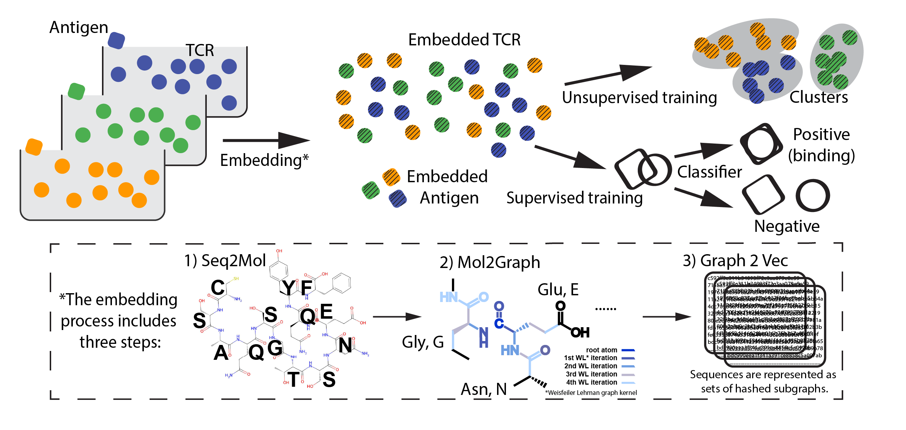

# G2VTCR
Graph-based Representation and Embedding of Antigen and TCR for Enhanced Recognition Analysis

*Figure 1. G2VTCR framework showing graph-based TCR and epitope representation.*

## Description
### Purpose
T cells are essential mediators of the adaptive immune response, playing a critical role in detecting infections and facilitating vaccination efficacy through antigen recognition via T cell receptors (TCRs). The **G2VTCR** framework empowers researchers by providing predictive insights into TCR-epitope specificity and facilitating TCR clustering. This tool addresses the vast and largely unexplored space of TCR-antigen interactions, which cannot be fully captured by experimental methods alone.

### Principle
The G2VTCR framework represents TCR and epitope sequences as atomic-level graphs, leveraging the structural and contextual information inherent in these sequences. By embedding TCRs and epitopes into a graph-based representation, the model predicts the interaction probability between a given TCR and epitope. A value close to one indicates a high likelihood of recognition by the TCR.

### Technical Details
G2VTCR employs a graph-based approach and a robust two-step training pipeline to capture biologically meaningful interactions:

- Graph Representation and Embedding:
TCR and epitope sequences are transformed into atomic-level graphs, where atoms represent nodes and chemical bonds represent edges. Weisfeiler-Lehman (WL) iterations are used to capture rich contextual subgraphs within these representations, enhancing the model's ability to interpret molecular interactions.

- G2VTCR leverages graph-based representations to perform either unsupervised clustering or supervised classification, depending on the research goal:
  - Clustering (Unsupervised)
TCR sequences are embedded into an atomic-level graph-based representation, capturing structural and contextual subgraph features using Weisfeiler-Lehman (WL) iterations. These embeddings are then clustered to group TCRs with similar structural and functional properties. This step highlights inherent relationships within the TCR repertoire, providing insights into their diversity and functional groupings.
  - Classification (Supervised)
Pairwise embeddings of TCR and epitope graphs are utilized to train a classification model. This step predicts the interaction probability between a given TCR and epitope pair, with the model output indicating the likelihood of recognition. The classification task ensures high specificity in identifying meaningful TCR-epitope bindings.

## Quick Tutorial

### Data Processing
Prepare and preprocess the raw input data to be used in downstream analysis.
```python
# Example: Load and preprocess data
from g2vtcr.data import preprocess_data

processed_data = preprocess_data(raw_data)
```

### Graph-based Embedding
```python
# Example: Embed sequences
from g2vtcr.embedding import embed_tcr

embeddings = embed_tcr(tcr_sequences)
```

### Clustering
Perform unsupervised clustering on TCR embeddings to identify groups with similar properties.
```python
# Example: Cluster embeddings
from g2vtcr.clustering import cluster_tcrs

clusters = cluster_tcrs(embeddings)
```

### Pattern Finding
Identify significant patterns or motifs within the clustered TCR sequences.
```python
# Example: Find patterns
from g2vtcr.patterns import find_patterns

patterns = find_patterns(clusters)
```

Classification
Predict TCR-epitope interactions using a supervised learning approach.
```python
# Example: Predict interactions
from g2vtcr.classification import predict_interactions

results = predict_interactions(tcr_epitope_pairs)
```


Please report any problems directly to the GitHub [issue tracker](https://github.com/princello/G2VTCR/issues)

Also, you can send your feedback to zw2595@cumc.columbia.edu


